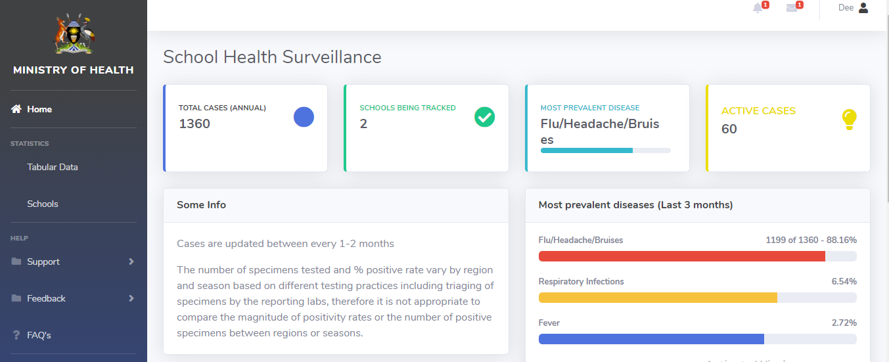

# School Health Surveillance System

User Dashboard and Admin Console for the School Health Surveillance System. 

## Preview

**[Launch Live Preview](https://cryptosavannah.github.io/SHS_with_endpoints/Dashboard/dashboard/)**

## Status

##  Features
1. Register an account
2. Login to the application

As a user:
1. View cases at National, District, Sub-County, Parish and School level.

As an admin:
1. Interact with the system as a regular user.
2. Allow User Permissions.
3. View all users.
4. Add schools to the system.
5. Add disease to the system.

## Getting Started
To get a copy of this project, clone the repo to your machine by running  `git clone https://github.com/CryptoSavannah/SHS_with_endpoints.git`

## Built With
1. [SB Admin 2](https://startbootstrap.com/themes/sb-admin-2/) (Open source admin dashboard theme for [Bootstrap](https://getbootstrap.com/) created by [Start Bootstrap](https://startbootstrap.com/).
2. [Javascript](https://www.w3schools.com/js/default.asp)

## API's Used
1. [School Health Surveillance API](https://github.com/CryptoSavannah/SHS_with_endpoints/tree/for_review/API)

## Bugs and Issues

Have a bug or an issue with this projecta? [Open a new issue](https://github.com/CryptoSavannah/SHS_with_endpoints/issues) here on GitHub.

## Copyright and License

Copyright 2013-2020 Start Bootstrap LLC. Code released under the [MIT](https://github.com/StartBootstrap/startbootstrap-resume/blob/gh-pages/LICENSE) license.